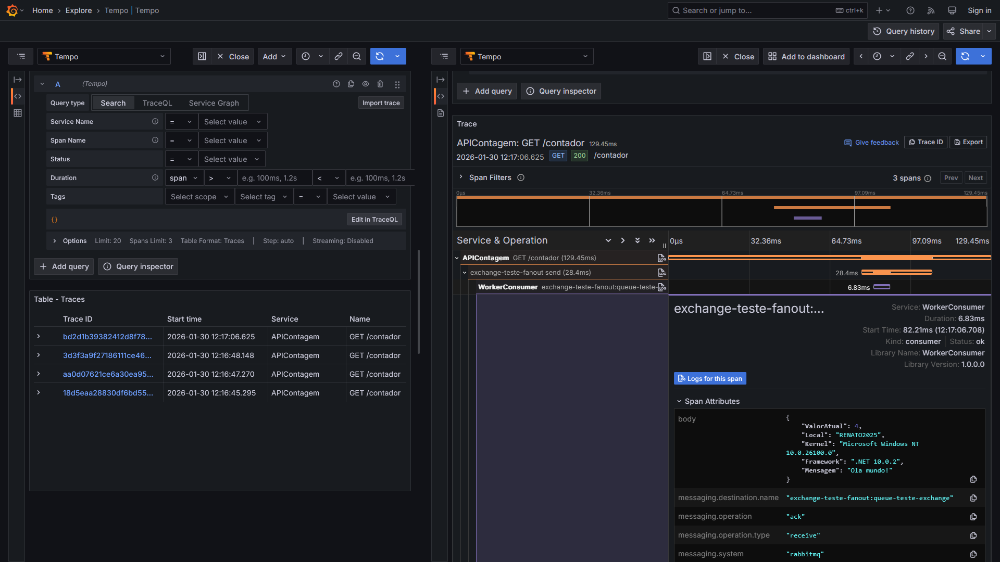

# dotnet10-worker-consumer-rabbitmq-exchange-fanout-otel-grafana
Exemplo de Worker Service que simula um Consumer do RabbitMQ baseado em uma queue vinculada a uma exchange do tipo Fan-out e com monitoramento via OpenTelemetry + Grafana + Alloy + Tempo. Inclui script do Docker Compose para subida do ambiente de testes.

Producer utilizado nos testes: **https://github.com/renatogroffe/aspnetcore10-producer-rabbitmq-exchange-fanout-otel-grafana**

Exemplo de telemetria gerada na comunicação entre essas 2 aplicações:

